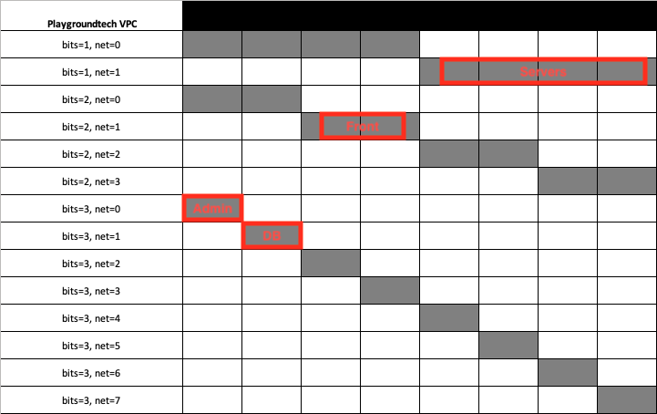

# Terraform AWS Network

This module can create the following components for the management of your AWS Network:

- `aws_vpc`
- `aws_subnet`
- `aws_internet_gateway`
- `aws_default_network_acl`
- `aws_nat_gateway`
- `aws_eip`

## Provisional Instructions

#### Minimal

```hcl
module "nwk" {
  source            = "playgroundtech/nwk/aws"
  version           = "1.0.0"
  name              = "test"
  vpc_cidr          = "10.0.0.0/16"
  subnets_byname    = ["test", "test1", "test2"]
  availability_zone = ["eu-north-1a"]
}
```

#### High Availability

```hcl
module "nwk" {
  source            = "playgroundtech/nwk/aws"
  version           = "2.0.0"
  name              = "test"
  vpc_cidr          = "10.0.0.0/16"
  subnets_byname    = ["test", "test1", "test2"]
  availability_zone = ["eu-north-1a","eu-north-1b","eu-north-1c"]
}
```

#### 2-tier Public / Private with High Availability

```hcl
module "nwk" {
  source            = "playgroundtech/nwk/aws"
  version           = "2.0.0"
  name              = "test"
  vpc_cidr          = "10.0.0.0/16"
  subnets_byname    = ["Front-1", "Front-2", "Front-3", "Back-1", "Back-2", "Back-3"]
  public_subnets    = ["Front-1", "Front-2", "Front-3"]
  availability_zone = ["eu-north-1a","eu-north-1b","eu-north-1c"]
}
```

#### 3-tier Public / Private with High Availability

```hcl
module "nwk" {
  source            = "playgroundtech/nwk/aws"
  version           = "2.0.0"
  name              = "test"
  vpc_cidr          = "10.0.0.0/16"
  subnets_byname    = ["Front-1", "Front-2", "Front-3", "Back-1", "Back-2", "Back-3", "DB-1", "DB-2", "DB-3"]
  public_subnets    = ["Front-1", "Front-2", "Front-3"]
  availability_zone = ["eu-north-1a","eu-north-1b","eu-north-1c"]
}
```

#### Subnet By Bits Read More Here: [subnet sizing](#subnet-sizing)

```hcl
module "nwk" {
  source            = "playgroundtech/nwk/aws"
  version           = "2.0.0"
  name              = "test"
  vpc_cidr          = "10.0.0.0/16"
  subnets_bybits    = [
    { name = "App", bits = 1, net = 1 },
    { name = "Front", bits = 2, net = 1 },
    { name = "DB", bits = 3, net = 1 },
    { name = "Admin", bits = 3, net = 0 }
  ]
  availability_zone = ["eu-north-1a", "eu-north-1b", "eu-north-1c"]
}
```

#### Subnet By Cidr Read More Here: [subnet sizing](#subnet-sizing)

```hcl
module "nwk" {
  source            = "playgroundtech/nwk/aws"
  version           = "2.0.0"
  name              = "test"
  vpc_cidr          = "10.0.0.0/16"
  subnets_bycidr    = [
    { name = "App", cidr = "10.0.0.128/26" },
    { name = "Front", cidr = "10.0.0.64/26" },
    { name = "DB", cidr = "10.0.0.32/27" },
    { name = "Admin", cidr = "10.0.0.0/27" }
  ]
  availability_zone = ["eu-north-1a", "eu-north-1b", "eu-north-1c"]
}
```

### Variables

- `name` | (Required) - String  
  Name to be used on all the resources as identifier

**VPC Variables:**

- `vpc_cidr` | (Required) - String  
  The CIDR block for the VPC.

- `instance_tenancy` | (Optional) - String  
  A tenancy option for instances launched into the VPC.  
  Each instance that you launch into a VPC has a tenancy attribute. This attribute has the following values:  
  `default` - Your instance runs on shared hardware.  
  `dedicated` - Your instance runs on single-tenant hardware.  
  `host` - Your instance runs on a Dedicated Host, which is an isolated server with configurations that you can control.  
  After you launch an instance, there are some limitations to changing its tenancy.  
  You cannot change the tenancy of an instance from `default` to `dedicated` or `host` after you've launched it.  
  You cannot change the tenancy of an instance from `dedicated` or `host` to `default` after you've launched it.  
  _Default: "default"_

- `vpc_tags` (Optional) - Map(string)  
  Additional tags for the VPC  
  _Default: {}_

- `enable_dns_support` (Optional) - Bool  
  A boolean flag to enable/disable DNS support in the VPC.  
  _Default: true_

- `enable_dns_hostnames` (Optional) - Bool  
  A boolean flag to enable/disable DNS hostnames in the VPC.  
  _Default: true_

**Subnet Variables**  
You can read up on different subnet sizing under [subnet sizing](#subnet-sizing).

- `availability_zone` | (Required) - List(string)  
  The AZ for the subnet

- `subnet_bits` | (Optional) - Number  
  _Default: -1_

One of `subnets_byname`, `subnets_bybits` or `subnets_bycidr` must be used:

- `subnets_byname` | (Required/Optional) - List(string)  
  The name of the subnets you want to create. Each name will create a new subnet. The subnets will be divided into 8 equally-sized if `subnet_bits` isn't changed.  
  Please read more under [subnet sizing](#subnet-sizing).  
  _Default: []_

- `subnets_bybits` | (Required/Optional) - List(object({name=string,bits=number,net=number}))  
  List of object to create your subnet. This will create subnet based on bits and net set by the user.  
  Please read more under [subnet sizing](#subnet-sizing).  
  _Default: []_

- `subnets_bycidr` | (Required/Optional) - List(object({name=string,cidr=string}))  
  List of object to create your subnet. This will create subnets based cidr set by the user.  
  Please read more under [subnet sizing](#subnet-sizing).  
  _Default: []_

- `public_subnets` | (Optional) - List(string)  
  The names of which subnets you want to set as public subnets.  
  _Default: []_

**Internet Gateway**

- `internet_gateway_tags` | (Optional) - Map(string)  
  Additional tags for the Internet Gateway.  
  _Default: {}_

- `route_table_public_tags` | (Optional) - Map(string)  
  Additional tags for the Public Route Table.  
  _Default: {}_

**Network ACL**  
This module can manage network ACL and rules.  
Once a VPC is created, AWS creates the default network ACL,  
so we copied that behaviour and made it possible to manage those rules.  
Which wouldn't be possible otherwise.

- `default_network_acl_ingress` | (Optional) - List(Map(String))  
  List of maps of ingress rules to set on the Default Network ACL.

---

The `default_network_acl_ingress` List of Maps accepts the following arguments:

- `rule_no` | (Required/Optional) - String  
  The rule number. Used for ordering.  
  _Default: "100" & "101"_
- `protocol` | (Required/Optional) - String  
  The protocol to match. If using the -1 'all' protocol, you must specify a from and to port of 0.  
  _Default: "-1"_
- `action` | (Required/Optional) - String  
  The action to take.  
  _Default: "Allow"_
- `from_port` | (Required/Optional) - String  
  The from port to match.  
  _Default: "0"_
- `to_port` | (Required/Optional) - String  
  The to port to match.  
  _Default: "0"_
- `cidr_block` | (Optional) - String  
  The CIDR block to match. This must be a valid network mask.
  _Default: null_
- `ipv6_cidr_block` | (Optional) - String  
  _Default: null_
- `icmp_code` | (Optional) - String  
  The ICMP type code to be used.  
  _Default: null_
- `icmp_type` | (Optional) - String  
  The ICMP type to be used.  
  _Default: null_

---

- `default_network_acl_egress` | (Optional) - List(Map(String))  
  List of maps of egress rules to set on the Default Network ACL.

---

The `default_network_acl_egress` List of Maps accepts the following arguments:

- `rule_no` | (Required/Optional) - String  
  The rule number. Used for ordering.  
  _Default: "100" & "101"_
- `protocol` | (Required/Optional) - String  
  The protocol to match. If using the -1 'all' protocol, you must specify a from and to port of 0.  
  _Default: "-1"_
- `action` | (Required/Optional) - String  
  The action to take.  
  _Default: "Allow"_
- `from_port` | (Required/Optional) - String  
  The from port to match.  
  _Default: "0"_
- `to_port` | (Required/Optional) - String  
  The to port to match.  
  _Default: "0"_
- `cidr_block` | (Optional) - String  
  The CIDR block to match. This must be a valid network mask.  
  _Default: null_
- `ipv6_cidr_block` | (Optional) - String  
  _Default: null_
- `icmp_code` | (Optional) - String  
  The ICMP type code to be used.  
  _Default: null_
- `icmp_type` | (Optional) - String  
  The ICMP type to be used.  
  _Default: null_

---

**NAT Gateway**

- `enable_nat_gateway` | (Optional) - Bool  
  Should be true if you want to provision NAT Gateways for each of your public subnets.
  _Default: false_

- `nat_route_table` | (Optional) - Bool  
  Should be true if you want to provision route table for NAT Gateways for each of your private subnets.  
  _Default: false_
### Subnet Sizing

You can decide your subnet size in three different ways or in a combination of them all.

- `subnets_byname` - a simple list
- `subnets_bybits` - a list of maps with names, network numbers and bits
- `subnets_bycidr` - specifying the exact CIDR.

`subnets_byname` & `subnets_bybits` creates the subnets sizes in relation to the CIDR range of the VPC, regarding both the size and ip-segment.  
With `subnets_bycidr`, you are in full control of everything regarding your subnets sizes.

#### subnets_byname

This will create subnets that will be divided into eight equally-sized parts and subnet CIDRs.  
To change the size of the subnets you can use `subnet_bits`, the default is three which gives 2^3 = 8 equally-sized parts and subnet CIDRs.  
If you set `subnet_bits = 4`, it will generate 2^4 = 16 equally-sized parts and subnet CIDRs.

#### subnets_bybits

This option gives you as a user more flexibility, but you as a user have to do some puzzle to get your size right.  
The subnets here doesn't have to be the same size with this option.  
To give an example:

- 50% of the CIDR range for your servers.
- 25% of the CIDR range for your frontend.
- Split the rest between admin & database.

```hcl
subnets_bybits = [
  {name = "Servers", bits=1, net=1},
  {name = "Front", bits=2, net=1},
  {name = "DB", bits=3, net=1},
  {name = "Admin", bits=3, net=0}
]
```

To give more visibility we will try to illustrate this in the following picture with 2^3 = 8 equally-sized parts:  


#### subnets_bycidr

Here you specify the exact CIDR you want for each subnet, but you now need to do this specifically for each environment as they have different VPC CIDR's. Using the same layout as above, this could be.

```hcl
subnets_bycidr = [
  {name = "Servers", cidr="10.0.0.128/26"},
  {name = "Front", cidr="10.0.0.64/26"},
  {name = "DB", cidr="10.0.0.32/27"},
  {name = "Admin", cidr="10.0.0.0/27"}
]
```

#### Summary

So the logic works like following:
Maps are created to the subnet to the subnets and their CIDR range.  
The maps are then merged to provide the actual map, which is used to generate the subnets.  
This means that you can combine the three methods if you want to.  
If you use the same names, then `subnets_byname` will be overwritten by the two other methods.  
`subnets_bybits` will be overwritten by `subnets_bycidr`.

### Outputs

- `vpc`
- `vpc_id`
- `subnets`
- `subnet_ids`
- `public_route_table_id`
- `private_route_table_id`
- `internet_gateway_id`
- `nat_gateway`
- `nat_gateway_ids`
